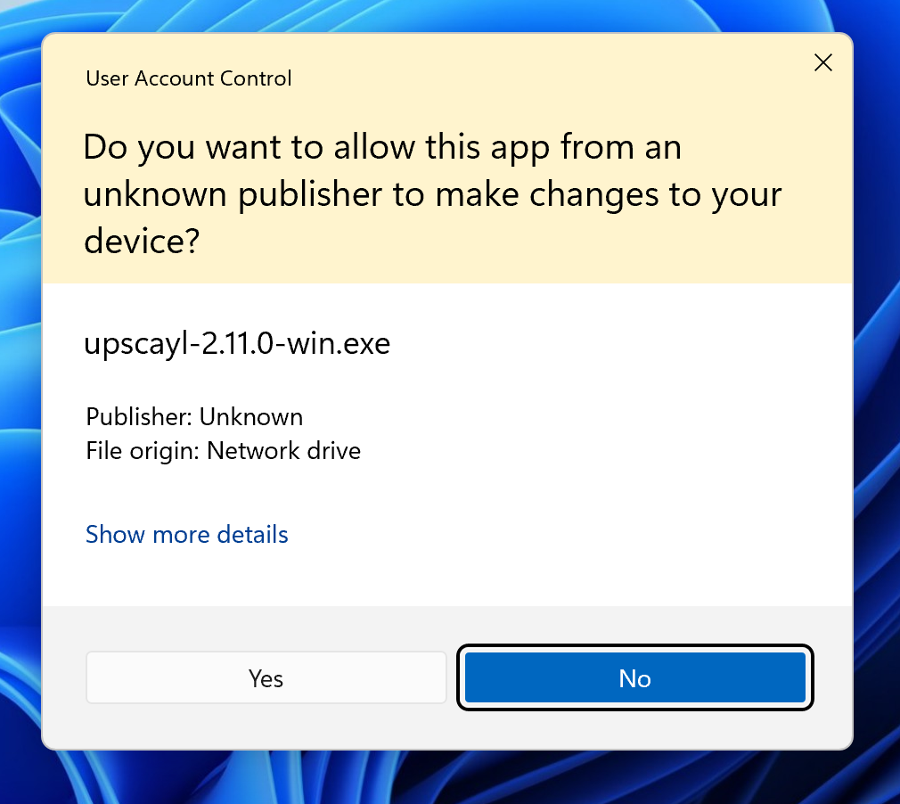

# Welcome to the Upscayl wiki!

Here we're trying to build documentation around Upscayl for everyone. If you have any suggestions, please feel free to let us know! :)

## Contents
- [🙋 How to ask for help?](https://github.com/upscayl/upscayl/wiki/%F0%9F%99%8B-How-to-ask-for-help%3F)
- [🧩 Compatibility List](https://github.com/upscayl/upscayl/wiki/Compatibility-List)
- [📖 User Guide](https://github.com/upscayl/upscayl/wiki/Guide)
- [🔨 Troubleshooting](https://github.com/upscayl/upscayl/wiki/Troubleshooting)
- [🖥️ Model Conversion Guide](https://github.com/upscayl/upscayl/wiki/Model-Conversion-Guide)
- [🤫 Miscellaneous Configuration](https://github.com/upscayl/upscayl/wiki/Misc)
- [🤯 Using Upscayl on Windows and Linux with only a CPU](https://github.com/upscayl/upscayl/issues/390)

